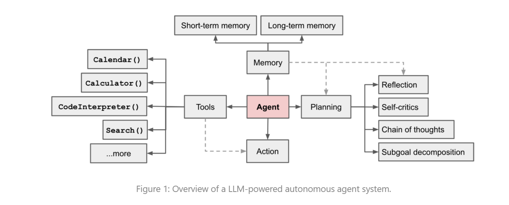
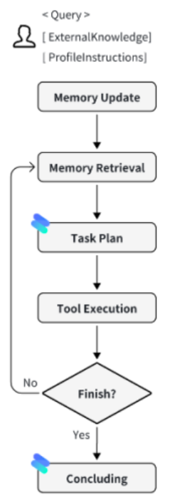

# 动手搭建自己的Agent系统From OpenManus
## 一、前言
现有模型的局限性就是Agent的出发点，推动 AI from static to dynamic，推动 AI from single to multi-agent。Agent 系统的目标是让 AI 能够自主地进行任务规划、执行和学习。
**Agent transfer to Chinese mean "代理"，术语中的代理性则是指行使表现如今模型能力的一种能力**
目前我们倾向于将所有能够感知环境、做出决策并采取行动(重点)的实体或者系统视为人工智能领域中的代理(ChatGPT也算)。
## 二、Agent 系统的组成部分
以自动驾驶Agent为例
1. **感知模块**：传感器、摄像头等设备收集环境信息。
2. **决策模块**：基于感知信息进行决策。
3. **执行模块**：将决策转化为实际行动。
因此Agent 包含以下组件
1. **感知器**:
   - 传感器、摄像头等设备收集环境信息。
   - 例如：图像处理、语音识别等。
   - GPT中的对话框
2. **知识库**
   - 存储和管理知识信息。
   - 例如：知识图谱、向量数据库等。
3. **决策引擎**
   - Agent分析感知信息结合知识库进行决策。
4. **执行器**
   - Agent 通过执行器在环境中采取动作。可以是物理动作Like 机器人，也可以是虚拟动作Like 通过MCP进行在线的请求服务
### 2.1 大模型是Agent的大脑
大模型在Agent系统中扮演着核心角色，负责处理复杂的决策和推理任务。它可以通过自然语言理解和生成与用户或其他系统进行交互。这些大模型不仅仅是信息处理和NLP任务的传统工具。更还是推动Agent从静态向动态决策者转变的关键。
1. Wei et al. (2022)提出了"Chain of Thought Prompting Elicits Reasoning in large Language Models."（思维链）方法，通过分解复杂任务为一系列简单步骤，展示了大模型在推理和决策中的潜力。
2. Yao et al. (2022)提出了"ReAct: Synergizing Reasoning and Acting in Language Models"（ReAct）方法，强调了大模型在推理和行动中的协同作用。
3. 问题分解: Khot等人(2022)提出了"Decomposing Complex Questions for Answering with Large Language Models"（问题分解）方法，展示了大模型在处理复杂问题时的能力。
4. Agent操作系统和多Agent协作。
   - 例如：AutoGPT、BabyAGI等。
   - 这些系统通过大模型实现了自主任务规划和执行。

以上都是构成现代Agent+LLM的重要论文方法。

**但LLM本质上仅仅是一个条件概率模型根据类似于Next prediction根据上文去预测下个词语。但大模型所产生的内容会与人类语言高度相似，能够创建基于特定上下文与人类相似的表达方式，因此他们能够与智能Agent的目的性行为相适应，成为Agent的逻辑引擎。**

### 2.2 Agent的知识、记忆、理解、推理以及表达、自我提升、泛化
首先大模型在预训练阶段获取了广泛的世界知识

## 三、基于大模型的Agent技术框架
Lilian Weng 在其博客中提出了一个基于大模型的Agent技术框架，包含以下几个关键组件：

Agent 系统处于中心位置，通过协调这些复杂的组件来处理复杂的任务
1. Planning Agent需要具备规划(同时包含决策)能力，以有能力来处理复杂任务，这涉及到图中的Subgoal decomposition以及思维链(Chain of Thought)等技术。自我评价和批评(Self-critics),以及对过去行动的反思(Reflection)等。
2. Memory ,Agent中的 Memory模块分为
   - Short-term memory: 用于存储当前任务的上下文信息。
   - Long-term memory: 用于存储长期知识和经验。(外部知识库)
3. Tools 这包括着Agent所能使用的各种工具和API接口，如搜索引擎、数据库、计算工具等。由于大模型一旦完成了训练，其内部能力和知识边界就基本固定了，而且难以拓展。例如Ask GPT 今天北京的天气怎么样？ 由于GPT没有实时的天气数据，所以无法回答。此时就需要通过API接口来获取最新的数据。


**<span style="color:skyblue">具体流程如上图所示可以看出 Agent系统的工作流程是一个循环的过程，Agent通过感知环境、做出决策、执行任务，并在执行过程中不断学习和改进。</span>**  
**<span style="color:red">引出新的Problem: Agent如何知道什么时候调用工具?-> 调用什么工具?</span>**
简单来说，大模型使用Prompt提示词给出类似工具的说明，输入输出格式，以及严重的约束条件。这些后续会详细说明。
### 3.1 Agent的规划和决策能力
Agent的规划和决策能力是其核心功能之一。大模型赋予Agent的规划能力相当于是人类的大脑。规划能够将复杂任务分解成更小、更易管理的子任务过程,包括以下的技术.

1. **思维链（Tought of chain），提示词技术，通过让模型"一步一步思考",帮助将打任务分解成小任务，并清晰的解释自己的思考过程**。
2. **思维树(Tree of Thoughts, ToT)**: 通过每个步骤来探索多种推理可能性,形成一种树形结构。可以使用不同的搜索方法例如广度优先搜索(BFS)和深度优先搜索(DFS)等。
3. "大模型+P":它使用PDDL（Planning Domain Definition Language）来描述问题，首先由大模型将问题转化成Probelm PDDL。请求外部规划器完成。

自我反思技术框架 ReAct、Reflexion、COH

``` python
import OpenAI
```