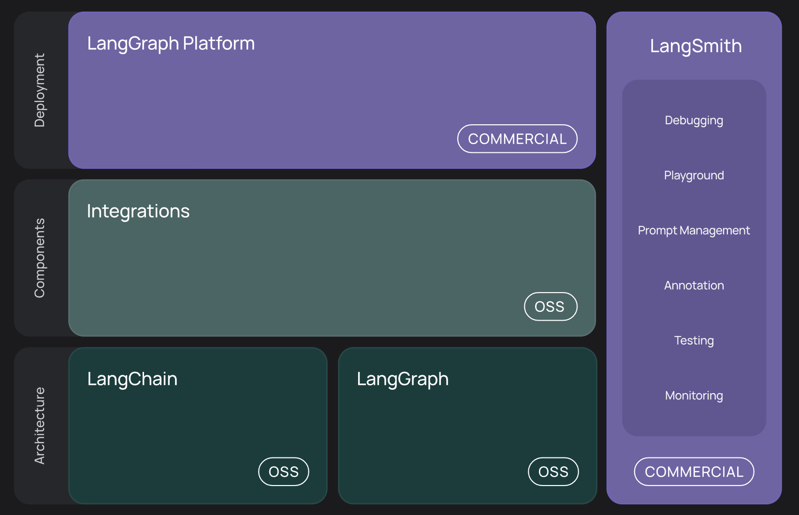

# LangChain LLM工具实现

LangChain本身仍然坚守作为“模型能力增强器”的功能定位，并且逐渐稳定更新节奏和频率，虽说实际使用LangChain进行开发的代码量仍然没变，但模块划分更加清晰、功能更加丰富和稳定，逐步达到企业级应用水准。目前最新版LangChain的核心功能如下：

| 模块类别 | 示例功能 |
|---------|---------|
| 模型接口封装 | OpenAI、Claude、Cohere、Qwen 等模型统一调用方式 |
| 输出结构化 | 自动从模型中解析 JSON、Schema、函数签名、文档等 |
| Memory 管理 | Buffer、Summary、Entity、Conversation Memory 等 |
| Tool 接入 | Web 搜索、SQL 数据库、Python 执行器、API 代理等 |
| Agent 架构 | ReAct、Self-Ask、OpenAI Function Agent 等调度机制 |
| RAG 集成 | 多种 Retriever、Vector Store、文档拆分策略 |
| Server/API 发布 | 快速将链部署为 Web 服务或 A2A Agent |
| Debug & Callback | Token 使用统计、LangSmith 可视化追踪等 |

**与2023年下半年开源LangGraph，LangGraph作为基于LangChain的更高层次封装，能够更加便捷的搭建图结构的大模型工作流，也就是现在所谓的Multi-Agent系统，而LangGraph也是目前LangChain家族最核心的Multi-Agent开发框架。同时可以搭配LangGraph-Studio进行实时效果监测，实际效果如下所示**



从本质上分析，LangChain从大模型角度出发，通过开发人员在实践过程中对大模型能力的深入理解及其在不同场景下的涌现潜力，使用模块化的方式进行高级抽象，设计出统一接口以适配各种大模型。LangChain抽象出最重要的核心模块如下：
1. Model I/O ：标准化各个大模型的输入和输出，包含输入模版，模型本身和格式化输出；
2. Retrieval ：检索外部数据，然后在执行生成步骤时将其传递到 LLM，包括文档加载、切割、Embedding等；
3. Chains ：链，LangChain框架中最重要的模块，链接多个模块协同构建应用，是实际运作很多功能的高级抽象；
4. Memory ： 记忆模块，以各种方式构建历史信息，维护有关实体及其关系的信息；
5. Agents ： 目前最热门的Agents开发实践，未来能够真正实现通用人工智能的落地方案；
6. Callbacks ：回调系统，允许连接到 大模型 应用程序的各个阶段。用于日志记录、监控、流传输和其他任务；
  从上图中可以看到，LangChain框架涵盖了模型输入输出的标准化、外部工具接入的规范、上下文记忆功能，以及对数据库、SQL、CSV等多种数据源的连接标准。通过核心的"Chain"高级抽象，定义了不同形式下标准的链接方法，这就能够允许开发者根据实际的应用需求和数据流向快速构建出一套完整的应用程序。这个过程类似于搭建积木，可以灵活适应不同的任务需求。
  因此本节公开课，我们就围绕LangChain展开详细的讲解，我们会涉及到LangChain框架的整体概览，如何用LangChain搭建智能体和本地知识库问答的完整流程，同时对于比较热门的MCP工具如何接入LangChain框架，会做一个重点的说明。
  需要说明的，这里我们选择使用Python作为开发语言，同时使用目前最新的LangChain 0.3版本，具体的版本说明如下：

```python
- Python==3.12
- LangChain>=0.3.25
- openai==1.5.0
- python-dotenv==1.0.0
```

```python
from openai import OpenAI

# 初始化DeepSeek的API客户端
client = OpenAI(api_key=DeepSeek_API_KEY, base_url="https://api.deepseek.com")

# 调用DeepSeek的API，生成回答
response = client.chat.completions.create(
    model="deepseek-chat",
    messages=[
        {"role": "system", "content": "你是乐于助人的助手，请根据用户的问题给出回答"},
        {"role": "user", "content": "你好，请你介绍一下你自己。"},
    ],
)

# 打印模型最终的响应结果
print(response.choices[0].message.content)
```

## 一、模型输入输出

## 二、Retrieval
